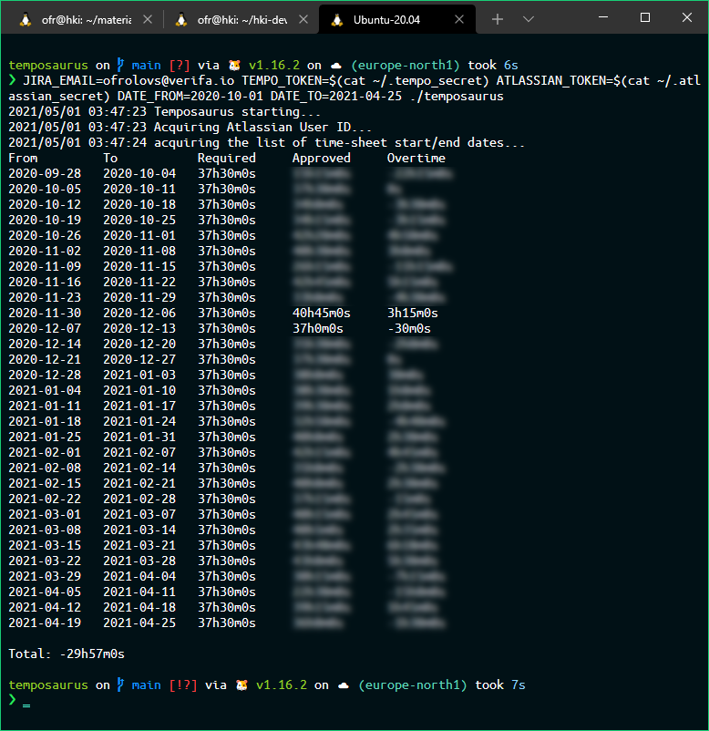

# Temposaurus

Temposaurus computes the running total of overtime from the data pulled from [Tempo](https://www.tempo.io/), the embedded time tracking tool for [Jira](https://www.atlassian.com/software/jira).

## Getting started

Temposaurus uses two REST APIs:

* [Jira Cloud v3](https://developer.atlassian.com/cloud/jira/platform/rest/v3/intro/)
* [Tempo v3](https://apidocs.tempo.io/)

Thus before starting Temposaurus you'll need to set up the access tokens for those APIs.

### Jira Cloud access token

Authentication with Jira Cloud API requires [setting up basic auth access to your Atlassian account](https://developer.atlassian.com/cloud/jira/platform/basic-auth-for-rest-apis/).

### Tempo access token

Authentication with Tempo API requires setting up a bearer access token to your Tempo data. The required scopes are `Periods` and `Approvals`. See [Using the REST API as an individual user](https://apidocs.tempo.io/).

### Compiling Temposaurus

Checkout the repo and `go build`.

### Running Temposaurus

Temposaurus is a CLI application which is controlled via environment variables.

Temposaurus recognises the following environmental variables.

| Mandatory | |
|-------------------|-----------------------------------------|
| `JIRA_EMAIL`      | Email address you use to login to Tempo |
| `ATLASSIAN_TOKEN`	| Jira Cloud API access token |
| `TEMPO_TOKEN`	    | Tempo API access token |
| `DATE_FROM`       | Start date |

&nbsp;

| Optional | |
|----------------|-----------------------------------------------------|
| `DATE_TO`      | Finish date. The default value is the current date. |
| `HTTP_TIMEOUT` | REST API client timeout in seconds. The default value is `30` seconds. |

The dates do not have to fall on the accounting period boundary as the correct boundaries will be computed, inclusive of both `FROM` and `TO` dates. The date format is `yyyy-mm-dd`, such as `2020-10-27`.

### Example

This is how I query the data for every week since my first week at work:

```bash
JIRA_EMAIL=ofrolovs@verifa.io \
TEMPO_TOKEN=$(cat ~/.tempo_secret) \
ATLASSIAN_TOKEN=$(cat ~/.atlassian_secret) \
DATE_FROM=2020-10-01 \
DATE_TO=2021-04-25
./temposaurus
```



Beware that your current (unapproved) timesheet may skew the result greatly, so choose the `DATE_TO` value wisely.

## Docker image

The Docker image is available from the Docker Hub: [olliefr/temposaurus](https://hub.docker.com/r/olliefr/temposaurus).

This is how I use it:

```bash
docker pull olliefr/temposaurus
```

```bash
sudo docker container run --rm -it -e JIRA_EMAIL=ofrolovs@verifa.io -e ATLASSIAN_TOKEN=$(cat ~/.tokens/atlassian) -e TEMPO_TOKEN=$(cat ~/.tokens/tempo) -e DATE_FROM=2021-04-12 olliefr/temposaurus
```

## TODO

* GitHub Releases
* Docker image built via goreleaser or Docker Hub Actions

## Contributing

To avoid frustration the following are the rules of engagement for Temposaurus.

| :shipit: | | 
|--------|-----------------------------------------------------------------------------------------------------------------|
| Issues | Please read the [It doesn't work](https://00f.net/2021/03/26/it-doesnt-work/) essay before submitting an issue. |
| PRs    | Please raise an issue to discuss first. |
| Forks  | Yes, please, as much as you'd like. |

## License

[Apache License 2.0](https://github.com/olliefr/temposaurus/blob/main/LICENSE)
